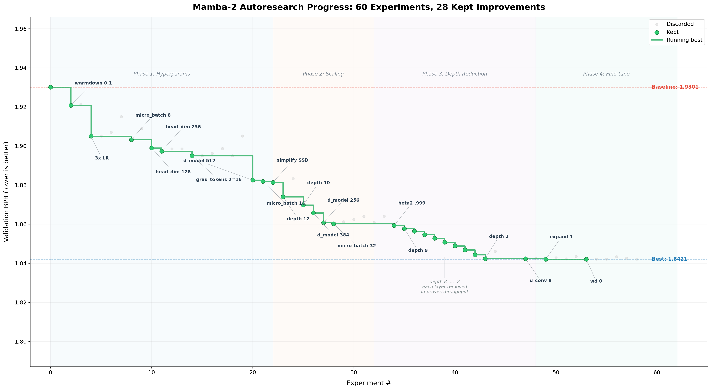
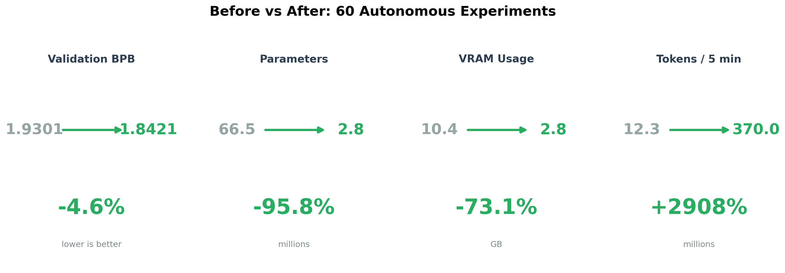

# Mamba-2 AutoResearch: 60 Autonomous Experiments on a State Space Model

An experiment applying [Karpathy's AutoResearch](https://github.com/karpathy/autoresearch) framework to **Mamba-2** — a State Space Model architecture fundamentally different from Transformers. An LLM agent (Claude) ran 60 experiments with zero human intervention, modifying the model architecture, optimizer, and hyperparameters under a fixed 5-minute GPU budget.



---

## Results

| Metric | Baseline | After 60 Experiments | Change |
|--------|----------|----------------------|--------|
| **val_bpb** | 1.9301 | 1.8421 | **-4.6%** |
| **Parameters** | 66.5M | 2.8M | **-96%** |
| **VRAM** | 10.4 GB | 2.8 GB | **-73%** |
| **Tokens / 5 min** | 12.3M | 370M | **+30x** |
| **Depth** | 16 layers | 1 layer | |

60 experiments. 28 kept. 31 discarded. 1 crash. All autonomous.



---

## What Is This?

**AutoResearch** is a [630-line Python framework](https://github.com/karpathy/autoresearch) by Andrej Karpathy that lets an LLM agent run ML experiments autonomously. The loop is simple: modify the training script, train for 5 minutes, check if validation improved, keep or revert, repeat.

**Mamba-2** ([Dao & Gu, 2024](https://arxiv.org/abs/2405.21060)) is a sequence model based on Structured State Space Duality (SSD). Unlike Transformers, it scales linearly with sequence length and has a completely different hyperparameter space: `d_state`, `d_conv`, `expand`, `chunk_size`, and SSD-specific settings.

**The question:** Can an autonomous agent navigate an architecture it has no Transformer-based intuitions for?

---

## How It Works

```
┌─────────────────────────────────────────────┐
│  Agent reads train.py + previous results    │
│               ↓                             │
│  Agent edits train.py (one change)          │
│               ↓                             │
│  Train for exactly 5 minutes on A10G        │
│               ↓                             │
│  Evaluate val_bpb (bits per byte)           │
│               ↓                             │
│  val_bpb improved?                          │
│     YES → keep change, commit               │
│     NO  → revert to previous version        │
│               ↓                             │
│  Repeat (60 times)                          │
└─────────────────────────────────────────────┘
```

The training script is a **from-scratch Mamba-2 implementation** in pure PyTorch (~640 lines), including the SSD algorithm, RMSNorm, causal convolutions, and a full training loop. No external model libraries.

---

## Key Findings

### Phase 1: Hyperparameter Tuning (Experiments 0-22)

The agent started with standard optimizer/schedule tweaks:

- **3x learning rate** (0.001 → 0.003): biggest single win (-0.025 BPB)
- **Warmdown ratio** 0.4 → 0.1: more time at peak LR
- **Batch size** 4 → 8: better hardware utilization
- **HEAD_DIM** 64 → 256: fewer heads, faster matmuls

Failed attempts: Muon optimizer (no improvement), removing logit softcapping (hurt stability), 6x LR (too aggressive).

**Result: 1.9301 → 1.8950 BPB (-1.8%)**

### Phase 2: Scaling Discovery (Experiments 22-30)

The agent tried **reducing model size** — cutting d_model from 768 to 512, then depth from 16 to 10. Fewer parameters meant more tokens could be processed in the fixed 5-minute budget. It worked: a directional finding consistent with Chinchilla scaling principles (under fixed compute, there's a tradeoff between model capacity and training data).

**Result: 1.8950 → 1.8602 BPB (-1.8%)**

### Phase 3: Depth Reduction (Experiments 30-48)

The agent kept following the same gradient: reduce depth → more tokens → better loss. It reduced the model from 10 layers all the way down to **1 layer**. Each step improved val_bpb, but the model went from a genuine deep network to a single-layer embedding + SSM + output projection.

**Result: 1.8602 → 1.8424 BPB (-1.0%)**

### Phase 4: Fine-tune Plateau (Experiments 48-60)

With depth exhausted, the agent tried architectural tweaks (expand 2→1, d_conv 4→8, weight decay → 0). Marginal gains. The optimization had hit a wall.

**Result: 1.8424 → 1.8421 BPB (-0.02%)**

### The Honest Takeaway

The agent found a real insight in Phase 2 (model/data tradeoff) but couldn't stop. It followed "reduce size → more tokens → better loss" all the way to a single-layer model. A human would have recognized the diminishing returns and pivoted to orthogonal explorations. **AutoResearch is excellent at hill-climbing but lacks the metacognition to know when it's in a rut.**


---

## Baseline Configuration

| Parameter | Value |
|-----------|-------|
| Architecture | Mamba-2 (SSD) |
| Depth | 16 layers |
| d_model | 768 |
| d_state | 64 |
| d_conv | 4 |
| expand | 2 |
| head_dim | 64 |
| Parameters | 66.5M |
| Context length | 2048 |
| Vocab size | 8192 (BPE) |
| Dataset | [climbmix-400b-shuffle](https://huggingface.co/datasets/karpathy/climbmix-400b-shuffle) |
| Optimizer | AdamW (multi-LR: matrix 0.001, embed 0.1, scalar 0.01) |
| Budget | 5 minutes wall-clock on A10G |
| Metric | Validation BPB (bits per byte) |

---

## Project Structure

```
mamba_auto_full/
├── train.py               # Mamba-2 model + training loop (~640 lines, pure PyTorch)
├── prepare.py             # Dataset download, BPE tokenizer, dataloader
├── program.md             # AutoResearch experiment instructions for the agent
├── results.tsv            # Full experiment log (60 experiments)
├── article_visuals.py     # Generate publication figures
├── visualize_results.py   # Results visualization
└── pyproject.toml         # Dependencies
```

---

## Acknowledgments

This project uses the [AutoResearch](https://github.com/karpathy/autoresearch) framework by Andrej Karpathy.

- **[Mamba-2](https://arxiv.org/abs/2405.21060)** by Tri Dao & Albert Gu — Structured State Space Duality
- **[Mamba](https://arxiv.org/abs/2312.00752)** by Albert Gu & Tri Dao — Selective State Spaces
- **[climbmix-400b](https://huggingface.co/datasets/nvidia/Nemotron-ClimbMix)** by NVIDIA — training dataset
- **Claude** (Anthropic) — autonomous agent running the experiment loop
